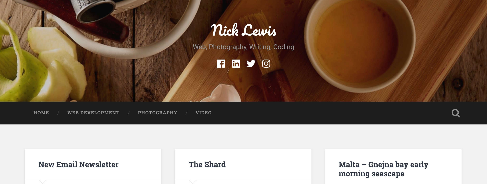

## The work that I do
The work that I do nowadays has taken me away from PHP development and into working with Javascript, HTML, CSS and libraries such as ReactJS. I think a lot of it is down to the way in which my contract work, my bread and butter has lead me down this path. It is great, I am loving it but it does mean some of my old skills have fallen to the wayside and are just not in demand from clients. My good old website, the former nicklewis.net, now [nicklewisweb.wordpress.com](http://nicklewisweb.wordpress.com) will remain up and running but the new site you are looking at right now is full of whizzy new stuff behind the scenes as much as what sits on the screen before you... 

## Enter the JAMStack
So move over Wordpress (no offence old buddy) and hello [Gatsby](https://gatsbyjs.org) with all that JAMStack brings. What is that though? It stands for Javascript APIs and Markup (or maybe Markdown to confuse things) and it opens up great possibilities for clients, developers and blog followers/readers in equal measure. To name a couple, it provides better website security, a big win plus some very nice workflow for the person(s) working on the project.

This website will be a lot more about what I do, the workflow that I follow and how this can really benefit those people that matter. So much so I am considering introducing this approach to all existing websites I host and those I build in the future. Yeah, that is pretty serious stuff indeed. It is like a technological whirlwind romance!

## What about the old posts?
So as I hinted above, the old blog will remain available and there will be a link to it on my about page. If you follow that blog, you will also see when new posts are made to this site, as I will adding some links there.... However you should instead, if you want to that is, sign up for our new mailing list and receive a newsletter from time to time.

## What is in store?
New categories and more content to come, I shall reveal these as time goes by...

## Facebook commenting
I am trying out the Facebook comment plugin rather than using Disqus. The FB coment plugin also facilitates a quick way of sharing to the platform. We also have a sharing bar at the bottom of each post on the blog, so please share far and wide!

