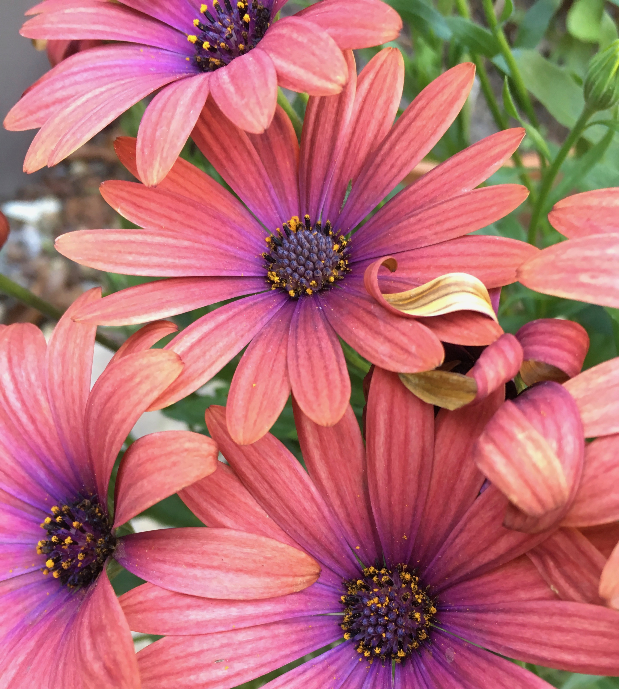
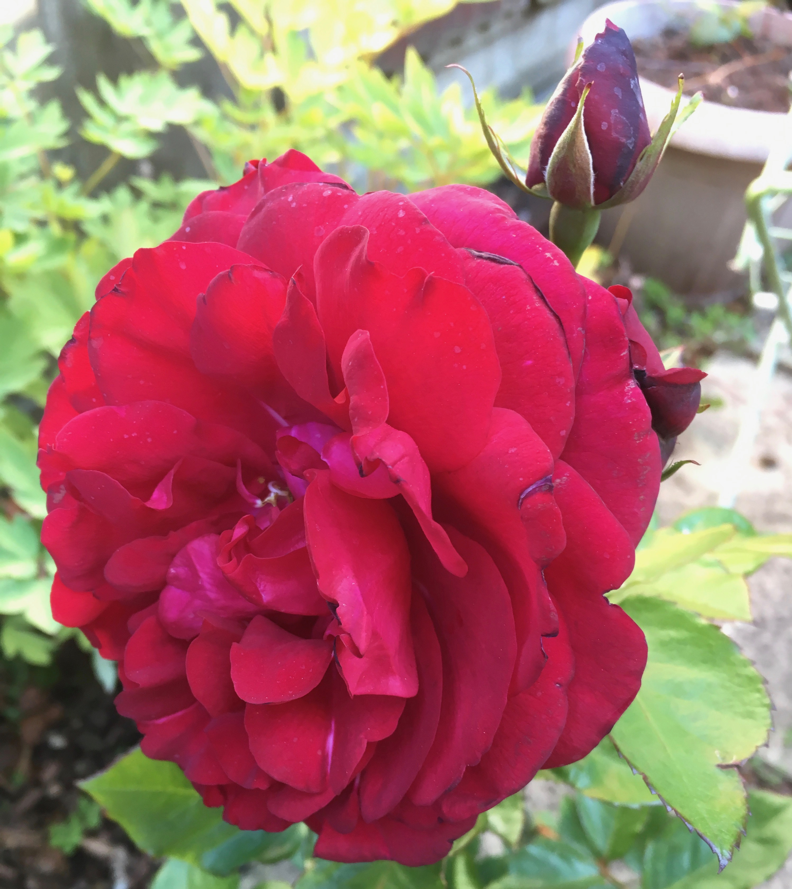

Every now and again in the past I have written a little journal entry for the blog talking about the things I have been up to and some of the interesting stuff I have picked up along the way that would be worth digging deeper into for some real tutorials and other kinds of articles.

Let me kick off with some good news updates, these are more personal to me and not all that important to other folks but worth writing about nonetheless!

## Health and fitness routines are progressing well

Referring back to my earlier post about [Health Issues](/health-matters-more-than-ever) I have taken some big steps towards reversing this and in the process have lost just over 4kg in a couple of weeks. I intend to continue this for the weeks to come. 

I find cycling is my best tonic and for me it has to be offroad, as the roads around our way are quite often very busy. So in the case of the photo below, I took on some challenging paths in the woods. I must admit that I pushed my bike up one or two fo them that were near vertical. Still it's good excercise even in doing that!

Strava is a fabulous app and the furthest ride I took last week was nearly 15 miles, as you can see below:

It was one of the hottest days we've had so far this Spring and gave me the chance to check out a route that was the last time I checked totally blocked at one point.

## Contract extension 

My contract with Logic Room has been extended once again giving me another 3 months of solid work up until the end of August as it stands right now. So I am very pleased about that and signed it off straight away. The problem is as with so many of these projects, is that I can't tell you much about it here for client confidentiality reasons. However I have been learning a massive amount about React Native, as part of this.

## Catching up with my parents

In my last blog post [Badbury Rings](/badbury-rings) I mentioned that we caught up with my parents down in rural Dorset and it gave us the chance to get outside again. Here are a few photos taken that I didn't share in my last post...

So as you saw from yesterday's post I got some drone footage in the bag and some aerial photos whilst I was at it. I did take a few pictures with my mobile too. Poppies always draw my eye, they are symbolic of course but also beautiful in that they add a little splash of red where green dominates!

I can't remember where this lovely place was and in a way want to keep it secret because it has become a favourite of my parents. We made some purchases here between us and we bought this fabulous Osteospurnum (pictured below)

Whilst we were at Cranbourne garden center in Dorset, we had just come back out to go back to our car and we came across this incredible looking car. On closer inspection it turned out to be a Nash, Ambassador Super which dates back to the 1950's. It was one of the first family cars of the post-war era in the USA that featured a slick aerodynamic design and was tested in a wind tunnel!

At this garden center we purchased this lovely rose!

