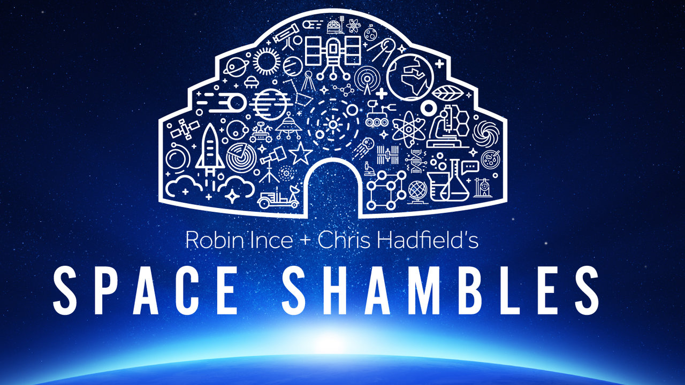

Every week I collate together all of the great digital/technical (even Space exploration this week) things I have come across in recent days, lots of little tidbits that don’t quite warrant a full length article of their own…. If there is anything you want me to go into in more detail, just pop a comment in the section below and beg me, maybe tip me (with crypto, now that would be cool)

## Another visit to Frensham to try out some new settings on the Mavic
Tina runs Scouts on Monday nights and it was a perfect evening to go for a quick fly over at Frensham. So here I present one of the many videos I have edited this week. It is short because I didn’t have a lot of time before I needed to be somewhere else, so I spent 30 minutes scrambling around the heathland to find a good spot to take off from, it was quite windy but the Mavic copes pretty well with light to medium winds. I found some wonderful old fallen Silver Birch trees for a bit of foreground interest. I then climbed to one of the highest points in the area and took off once more to get a view across to the lake but was then distracted by some people who I thought were going to take an interest in what I was doing but they passed on by without comment. 

In the end I edited the video down to around 1 minute!! Why? I like to edit to fit my video to some music plus also people tend to have short attention spans and we are happier to watch brief videos than something that goes on and on and on….. talking of which, less babble, watch the video!

`youtube:https://www.youtube.com/embed/nkFKltnn1G4`

The main point of this flight was to experiment with the settings on my Mavic Pro, as you can tweak so many things, ranging from flight dynamics to the camera itself. I used to shoot with the white balance, ISO, shutter speed and aperture set to Auto which I'd never do with my SLR after all! So I did a bit of reading, a bit of research and dived in. You can take a look at the [article I published earlier this week](https://www.nicklewis.net/on-location-episode-1/) which lists out the settings I used and what a difference it made.

## Photobox new HQ launch party
My old friend Dan Bachmann who has been working for Moonpig for many years (now part of the Photobox group of companies) invited us to the launch party in London. Dan was originally a member of the Nfolio team as we were back in the early 2000’s and I’ve stayed in contact with them all since we disbanded. I should write a piece on Nfolio at some point here, as it was an interesting project which introduced me to so many people, all of whom shared a big passion for photography. That's a story for another time...

The new Photobox HQ is an amazing place situated off Clerkenwall Road, Farringdon, London. We had free drinks, a DJ pumping out some great electronic music, massive video wall showing behind the scenes footage of the team and processes that deliver your photos to your doormats. So it was a great event and we stayed for about an hour or so before we headed off to find somewhere to eat. 

I must have been one of their early customers when they first started out which would have been around the same time I was running Nfolio. In fact we implemented and integrated with their services to enable people to order prints of their photographs from our website, which was revolutionary!

[Photobox website](https://www.photobox.co.uk/)

## Epidemic Sound
I love this website and the service it provides, it is without a doubt one of the best sources of Royalty Free music I have come across. Today I have been listening to [Epidemic Sound](https://player.epidemicsound.com/albums/album/611) a very mellow album called “Ocean Beats” and it could easily be the sort of thing you would listen to whilst sat on a beach in Corfu or somewhere like that :-) I have earmarked a number of tracks that will be well suited to future YouTube productions and I used one of these tracks for [On Location | Episode 1 | Frensham - Nick Lewis](https://www.nicklewis.net/on-location-episode-1/) - Expect more of these in the future…

### Also enjoyed…
* [Epidemic Sound](https://player.epidemicsound.com/albums/album/1238) - TOMAS SKYLDEBERG - STREETS OF PARIS
* [Epidemic Sound](https://player.epidemicsound.com/albums/album/1317) - Modern Classical
* [Epidemic Sound](https://player.epidemicsound.com/albums/album/854) - Electro Soundbeds

"Other music websites are available", as the BBC would say and I shall review more of them as I get more and more into video editing.

## The Bear is a great companion for any writer
Nope not the big furry sort but a fabulous writing app for the Mac and all iOS devices, great for people like me who use such tools for writing material for blogs and just keeping track of the stuff you are working on.

I use it for writing these articles and it supports the Markdown format which I then export and import into the website. I like this workflow because I can write anywhere, anytime and using any of my mobile devices. I’ve used it whilst sat on trains, planes and automobiles. Though not whilst I am driving, I hasten to add!

[Find out more about the app and download](https://www.bear-writer.com)

## Buffer - tip of the week
Quick intro: Buffer is a tool for people who publish across multiple Social Media platforms by enabling them to schedule their posts ahead of time, to go out at the most likely times of the day when you will engage with your audience. Phew that was a mouthful but pretty much sums it up…

I use Buffer heavily and as ever was an early adopter of their services. I use it to send my updates out to Twitter, Facebook, Instagram etc. I have various accounts for my personal social media, my business and some clients of mine. So as you can imagine this at times becomes a bit hard to stay on top of. So good tools are an absolute Godsend!

Anyway my tip is:

Buffer features a tool called “content inbox” and this is so useful because I can semi-automate posts not just from my site across to my social media audience but other peoples’ feeds too. So keeps sending out content to people with matching interests. This is a powerful thing and I would imagine people who do digital marketing would also find this very useful. It is certainly something I use a lot when I run multiple websites and that will only grow in the years to come.

[Buffer website](https://www.bufferapp.com)

## Photographer of the week
I came across Ralph Goldsmith via [Expat in Mazarron - YouTube](https://www.youtube.com/channel/UCOb6fkEakCC98MOVbe7x5JA) and his fantastic YouTube channel [Ralph Goldsmith - YouTube](https://www.youtube.com/user/NWLCoaching) is really informative. You can find links there to his other online locations. Ralph lives in Spain and produces a regular vlog each week. I enjoyed it immensely and have subscribed to follow his adventures via YouTube.

[[http:www.ralphgoldsmithphotography.com/]]

## Space Shambles

[Space Shambles | Cosmic Shambles](http://cosmicshambles.com/spaceshambles)

I would like to thank my friend and fellow freelancer, Lee Goodman for arranging this trip to London’s iconic Royal Albert Hall for a night of science, comedy, music and inspiration! 

It was hosted by Robin Ince (Infinite Monkey Cage) and Cmdr an Chris Hadfield (the guy who went viral on YouTube playing his guitar in space from the International Space Station with a fabulous David Bowie cover). In fact Robin Ince himself describes it all better in the link above. It was eclectic, exciting, funny, entertaining and highly enlightening
all at the same time. 

I was most excited to see a real Apollo astronaut appear on stage, in that kind of mid-forties guy becomes a kid of the seventies sort of way! It was great to see Rusty and later he played a laser version of “Lunar Lander” the iconic video game. Apologies for the overuse of “iconic” in this piece!

The highlight though was the moving tribute paid to the late Stephen Hawking by Chris Hadfield who was one of the people present when Hawking’s ashes were interred this week at Westminster Abbey. To think that he has been laid to rest along with Sir Isaac Newton and Charles Darwin was very apt. The piece was wrapped up with a great photo of Hawking with his University peers climbing walls and getting up to mischief. Seemed so cruel that nature dealt him such a cruel blow when he had one of the greatest minds of  our time. Chris Hadfield hailed him as a personal hero and I have to say he was one of mine too for he made the science accessible to all.

So Space Shambles was a lot of fun and proves that us nerds, geeks or whatever you want to call us are a jolly fun bunch to hang out with!

I do hope they do another one next year, if they do I will buy my tickets straight away!

## That’s it folks!

Hope you’ve enjoyed my weekly ramble? It’s been quite a week and work has been busy too, I will write more about that in my next weekly round-up.

